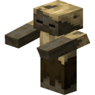

# Σχετικά με το έργο Project PAP Survival

*Το Project PAP Survival είναι το επίσημο site του server μας και φιλοξενείτε από το GitHub Pages. Αυτή την στιγμή όλες οι υπηρεσίες που είχαν ξεκινήσει σε open source έκλεισαν καθώς το site ξεκινάει να στήνεται εκ νέου.*

  
## Τι είναι τα έργα ανοιχτού κώδικα

Τα έργα ανοιχτού κώδικα είναι έργα που ο κώδικάς τους είναι διαθέσιμος σε όλους με σκοπό να βάλουν και εκείνοι το δικό τους κομμάτι κώδικα ώστε να βοηθήσουν στην ανάπτυξη τους
